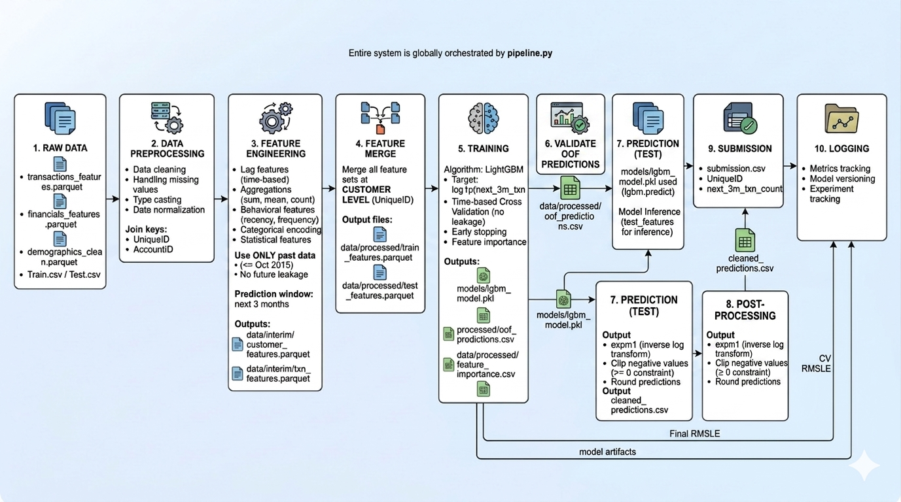

# Customer Transaction Volume Forecasting

A machine learning pipeline that predicts the number of transactions a banking customer will perform over the next 3 months, using historical transaction, demographic, and financial data.

---

## Overview

This project builds a supervised regression model to forecast future customer transaction counts. The target variable is `next_3m_txn_count`, and the primary metric is **RMSLE (Root Mean Squared Logarithmic Error)**.

The full workflow — from raw data to predictions — is orchestrated through a single entry point:

```bash
python src/pipeline.py
```

---

## Skills & Prerequisites

| Area | Level |
|---|---|
| Python | Intermediate |
| Pandas / NumPy | Comfortable |
| Machine Learning | Fundamentals |
| Gradient Boosting (LightGBM) | Basic familiarity |
| CLI usage | Basic |

---

## Project Structure
project/
├── src/               # All source code (features, modeling, utils)
├── data/
│   ├── raw/           # Original input files (not versioned)
│   ├── interim/       # Intermediate feature files
│   └── processed/     # Final merged features (Parquet)
├── models/            # Saved model artifacts
├── submissions/       # Prediction output files
└── notebooks/         # Exploratory analysis only (not required to run pipeline)

> `src/pipeline.py` is the **main orchestrator**. It controls the full workflow end-to-end via `--steps` arguments.

---

## Pipeline Overview



---

## Installation

### 1. Clone the repository

```bash
git clone https://github.com/Abbes2004/Nedbank-Transaction-Volume-Forecasting-Challenge.git
cd Nedbank-Transaction-Volume-Forecasting-Challenge
```

### 2. Create required directories

```bash
mkdir -p data/raw data/interim data/processed models submissions
```

### 3. Install dependencies

```bash
pip install -r requirements.txt
```

---

## Data Setup

Download the dataset files (`.zip` and `.csv`) .

This dataset is provided by Nedbank via Zindi Africa.

> ⚠️ The data cannot be redistributed. 
> Download it directly from the official competition page:
> https://zindi.africa/competitions/nedbank-transaction-volume-forecasting-challenge/data
> 
> You must create a free Zindi account to access the files.

Once downloaded, place the files in `data/raw/`.

```bash
unzip data/raw/<filename>.zip -d data/raw/
```

---

## How to Run

### Step 1 — Build features

```bash
python src/pipeline.py --steps transactions financials demographics merge
```

Processes raw data, engineers features for each domain, and merges them into a single Parquet file ready for training.

### Step 2 — Train, predict, and validate

```bash
python src/pipeline.py --steps train predict validate
```

Trains the LightGBM model using cross-validation, generates predictions, and evaluates performance using RMSLE.

---

## Output

After running the full pipeline, the following artifacts are produced:

| Output | Location |
|---|---|
| Trained model | `models/` |
| Processed feature set | `data/processed/` |
| Predictions file | `submissions/submission.csv` |

---

## Design Notes

- **Pipeline-driven architecture** — the entire workflow is triggered from a single script with composable steps.
- **Modular feature engineering** — transactions, financials, and demographics are processed independently before merging.
- **Log-transformed target** — `log1p` is applied to `next_3m_txn_count` before training and reversed on output to ensure RMSLE-optimized predictions.
- **Reproducible workflow** — all intermediate outputs are saved as Parquet files, enabling re-entry at any pipeline step.
- **Notebooks** (`notebooks/`) are used for exploratory analysis only and are not required to run the pipeline.